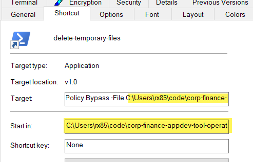

# About
The folder-emptying utility deletes everything (files and folders) in each of the folders specified in Folders_To_Empty.txt.
By default, Folders_To_Empty.txt has standard Windows temporary folders, like %TEMP%.
You can add or adjust it by putting each folder on its own line. Environment variables are allowed, such as %WINDIR%\Temp, which is usually C:\Windows\Temp.

# Installation
1. Download all files in this folder.
2. If you would like to run the utility via double-click, you will need to replace the path to it and its folder in the shortcut file, then click OK. The shortcut can be placed anywhere on your computer and will still work.

# Using the utility
There are 3 ways to use the utility:
1. By double-clicking the shortcut, assuming you set it up and want to run it on-demand.
2. By right-clicking the file delete-temporary-files.ps1 and choosing "Run with PowerShell".
3. By creating a scheduled job to run delete-temporary-files.ps1 on a schedule.
